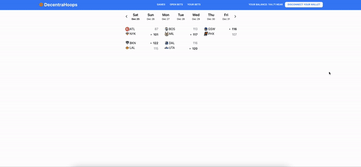

# Decentrahoops

## [Link to Live Site](https://near-sportsmarketplace.vercel.app/)

# Why build this project?

Current sportsbooks have an unclear way of creating their odds and the profit margins are baked into these odds. Based on various sources, the profit margins can range anywhere from 2.8% to 8%.

By utilizing the Near blockchain, and outsourcing the sportsbook to the users, we can effectively reduce this down to 2.5% - which will be used to fund future developments and marketing. See **[Next Steps](#next-steps)** for more details.

This represents a win for users through lower fees, more choice in the marketplace for sportsbetting, and their own way to create odds.

### Table of Contents

**[But really, why build this project?](#real-reason)** 
**[Technology Stack](#technology-stack)** 
**[Lessons](#lessons)** 
**[Next Steps](#next-steps)** 

# But really, why build this project?

I wanted to build an end-to-end blockchain project to truly understand how blockchain technology works, its viability as a long-term solution, and how to connect what we have in web2 to web3.

Specifically, I've always had an interest in the NBA and as well, they provide a free open-source API through [data.nba.net](http://data.nba.net/10s/prod/v1/today.json) which makes this possible to host for free to demo.

# Technology Stack

Below is a highlight of all the major technologies I used in this project and reasons why.

Programming Languages

1. Programming Language: Rust - programming language
   - Rust is a type safe and no garbage collection programming language. It is known to be _blazingly fast_.
   - Rust is also picking up a lot of notarity and becoming more popular given the above description.
   - Near Protocol also chose Rust as its programming language.
2. Programming Language: Javascript - programming language
   - Most of today's websites / apps are programmed in JS (also React is built on JS and so it is clear I needed javascript.)
3. Blockchain: Near Protocol
   - A fast, cheap, and reliable blockchain which uses sharding to scale.
   - Near Protocol was extremely easy to get started with (only took a month of learning Rust) and its documentation is great. It has been much easier to understand how it works end-to-end than for example Solana or Ethereum.
4. Frontend: React
   - Very popular front-end library.
   - It is the standard for building apps.
5. CSS: Tailwind
   - Starting to become the standard for CSS as it is highly customizable
   - Is more or less unopinionated vs. MUI or Bootstrap in how you handle your CSS.
6. Hosting: Vercel
   - Free hosting service and easy integration with github.

# Lessons

1. Rust is hard.
   - I knew that learning a new language would be hard, but Rust took it to another level.
   - The type-safety made it quite hard to start but I started to understand it more as time progressed.
   - Will be interesting to see how TypeScript type safety compares to Rust.
2. Be aware of feature-creep.
   - I got a bit too boggled down with "nice to have" features.
   - For the next project, I'll have clearly defined features to ensure I am delivering the core of the application.
   - On the bright side, I dived pretty deep into Tailwind and become a lot more knowledgeable in it!
3. Blockchain does have a viable future, just not now.
   - Amongst others, there are two simple descriptions for cryptocurrencies / blockchain
     - Cryptocurrency is innovative as it is programmable money.
     - Blockchain is like a public database (an oversimplification is that it is similar to SQL or Mongo).
   - This project showed me that by using cryptocurrency and blockchain technology, a company like DraftKings can potentially reduce their fees/margin.
   - DraftKings or other sports betting apps would depend on Stripe or Visa for their payments. At minimum, they would charge 3% to DraftKings for their services, which would eat into their profit margins.
   - By leveraging blockchain technology, you can effectively reduce this down to near 0% by not depending on Stripe or Visa.
   - Now for the why not now, the user experience for blockchain is still in its infancy. It is still too clunky for users to:
     1. Deposit their fiat currency in an exchange.
     2. Withdraw their cryptocurrency into a custodial wallet.
     3. Understand how the wallet works.
   - Not only this, but there are so many layer 1 blockchains out there (e.g. Ethereum, Near, Solana, Aptos, Sui, AVAX, etc.), and as fair as I am aware, there is still no interoperability in these yet that is simple to use. It is hard for a user to understand which one to use.
4. Learnt how to take blockchain technology from end to end.
   - Learnt how to pick the tech stack based on the requirements needed.
   - Went from defining the problem, to figuring out the tech stack and the implementation of the tech stack to solve the problem.

# Next Steps

Next steps for when I pick this project up again:

1. Currently using past data. I'll need to pick this up closer to October 2023 when the new NBA season starts to ensure the functionality works the way it is intended to with live game data.
2. Work on the security of the smart contract. There are a few bugs / hacks in there for people to drain the smart contract. Will need to review and test to make sure the smart contract does not get drained.

Long Term (if anybody wants to continue with this project):

1. Market this project (something I personally am bad at).
2. Solve the legality of this app and if you would need a gambling license.
   - Arguable that this is a marketplace for sports betting, so a gambling license isn't needed as we are not a sportsbook.
3. Figure out a way to get liquidity / users.
   - Since this is a marketplace, we need users to bet on games and create their own odds.
4. Funding. We also need capital to fund future feature developments, marketing expenses, legal fees for point #2, smart contract auditing, etc.
   - One solution is to use NFTs as a way to get capital to fund these and as well, get users (point #3) and as a marketing tactic (point #1)
   - As the developers, we would get access to capital. We would also need to do this the right way with some form of accounting and ensure we are held accountable to the development process (i.e. not just spending money just because we got the capital now.)
   - We can reward NFT holders by giving them 0% commissions on trades and maybe 10% of all trade fees will be given back to users (for example).
   - Also as bonus, if the technology gets bought out by a web2 company (e.g. DraftKings), we will give NFT holders a portion of the profits as a thank you for supporting us
